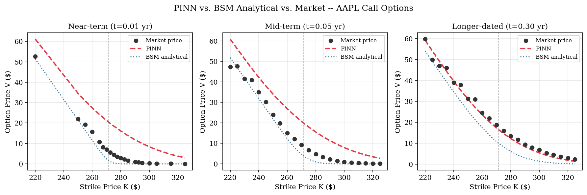
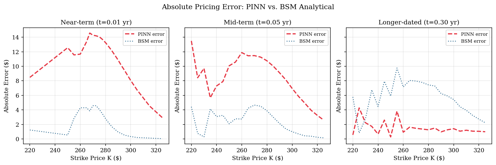
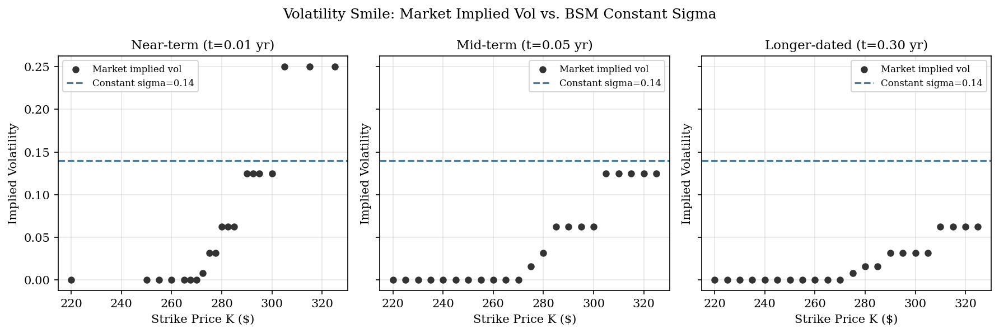
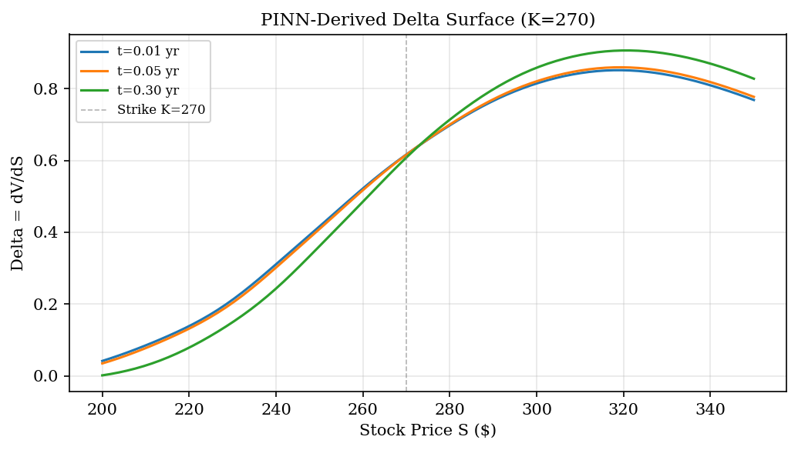

# Parametric Black-Scholes PINN

A **Physics-Informed Neural Network** that solves the Black-Scholes-Merton PDE to price European call options — without ever seeing a real market price during training.

The key contribution over prior PINN work: I treat strike price **K as a model input** rather than a fixed constant, so a single trained model prices an **entire options chain** in one forward pass. I tested it against 64 live AAPL call contracts across three expiration dates pulled from `yfinance`.

**[Paper](paper/paper.pdf)** · **[Slides](paper/CS66_presentation.pdf)**

---

## Why not just a regular neural network?

| Regular NN | This (Parametric PINN) |
|---|---|
| Needs thousands of real market prices to train | Trained purely on synthetic collocation points — zero real prices used |
| Learns statistical patterns in data | Learns the BSM equation itself, baked into the loss |
| Extrapolates nonsense outside training data | Generalizes correctly across the entire (S, t, K) domain |
| One model per strike price K | One model prices the full options chain |

---

## Results

Evaluated on **64 held-out AAPL call contracts** (never seen during training):

| Tenor | N | PINN MAE ($) | BSM Analytical MAE ($) |
|---|---|---|---|
| Near-term (t=0.01 yr, ~4 days) | 20 | 10.96 | **2.17** |
| Mid-term (t=0.05 yr, ~2.5 wks) | 22 | 8.39 | **2.28** |
| Longer-dated (t=0.30 yr, ~3.5 mo) | 22 | **1.52** | 5.64 |
| **Overall** | **64** | 6.83 | 3.40 |

The PINN **outperforms the analytical BSM formula for longer-dated contracts** ($1.52 vs $5.64 MAE). It struggles near expiry, where the `max(S−K, 0)` payoff becomes nearly discontinuous — a known limitation of smooth networks called the *sharp boundary problem*.

---

## Architecture

```
Input: [S, t, K]  →  normalized to [0, 1]
  Linear(3 → 64) + Tanh
  Linear(64 → 64) + Tanh
  Linear(64 → 64) + Tanh
  Linear(64 → 1)
Output: V  (option price)
```

**Tanh, not ReLU** — the BSM PDE requires computing ∂²V/∂S² (Gamma). ReLU's second derivative is zero almost everywhere, so it can't represent the curvature the equation demands. Tanh is infinitely differentiable.

**float64, not float32** — second-order derivatives amplify floating-point errors. Double precision keeps training numerically stable.

---

## Loss Function

The physics are baked directly into training via two terms:

```
L = L_PDE + L_BC

L_PDE = mean( [∂V/∂t + ½σ²S²·∂²V/∂S² + rS·∂V/∂S − rV]² )   # BSM residual
L_BC  = mean( [V(S, T, K) − max(S−K, 0)]² )                    # payoff at expiry
```

Both terms are computed via PyTorch autograd through the network — no finite differences anywhere.

---

## Free Greeks via Automatic Differentiation

Because the network is fully differentiable, I get risk sensitivities at inference time for free:

```python
delta = torch.autograd.grad(V, S, grad_outputs=torch.ones_like(V), create_graph=True)[0]
gamma = torch.autograd.grad(delta, S, grad_outputs=torch.ones_like(delta))[0]
```

No finite-difference approximation, no grid recomputation. The Delta surface shows the correct S-shaped curve crossing Δ≈0.5 at the strike, consistent with BSM theory.

---

## Training Setup

| Parameter | Value |
|---|---|
| PDE collocation points | 10,000 (S∈[170,370], t∈[0,1], K∈[220,320]) |
| Boundary condition points | 2,000 (at t=T) |
| Epochs | 10,000 |
| Optimizer | Adam, lr=1e-3 |
| Hardware | NVIDIA RTX 6000 Ada (96 GB VRAM) |
| Risk-free rate r | 0.04 (13-week T-Bill yield, live from yfinance) |
| Volatility σ | 0.14 (1-year AAPL historical vol, annualized) |

Parameters r and σ were calibrated programmatically from live market data — not hand-tuned.

---

## Quick Start

```bash
pip install torch numpy pandas matplotlib yfinance scipy
```

Open [`code/PINN_code.ipynb`](code/PINN_code.ipynb) and run all cells. The notebook trains the model on synthetic data, pulls live AAPL option chains, evaluates against market prices, and generates all paper figures. GPU recommended; falls back to CPU automatically.

---

## Repository Structure

```
BSM-PINN/
├── code/
│   ├── PINN_code.ipynb                  # Model definition, training, evaluation, figures
│   ├── AAPL_historical_behavior.ipynb   # Historical vol calibration / EDA
│   └── proof_of_concept.ipynb           # Early single-strike prototype
├── paper/
│   ├── paper.tex / paper.pdf            # Full research paper (ICML template)
│   ├── fig1_surface_comparison.png      # PINN vs BSM vs market prices
│   ├── fig2_error_by_tenor.png          # Absolute error across tenors
│   ├── fig3_vol_smile.png               # Market implied vol vs constant σ
│   ├── fig4_delta_surface.png           # PINN-derived Delta via autograd
│   ├── table1_results.csv               # MAE / relative error by tenor
│   └── table2_moneyness.csv             # MAE by moneyness (ITM / ATM / OTM)
├── planning/
│   └── aaidark1_project_proposal.pdf
└── presentation/
    └── CS66_presentation.pdf
```

---

## Visualizations

### Price Surface: PINN vs BSM vs Market


### Absolute Error by Tenor


### Volatility Smile


### PINN-Derived Delta Surface


---

## Paper

Full write-up in [`paper/paper.pdf`](paper/paper.pdf). Covers the BSM PDE derivation, the parametric formulation (why K-as-input is the key design choice), quantitative comparison across tenors and moneyness buckets, volatility smile analysis, training convergence, and social implications of deploying physics-constrained pricing models at scale.

---

## Future Work

- **Adaptive collocation near t=T** — concentrate training points at expiry to reduce the sharp boundary error
- **Inverse PINN** — treat σ as a learnable function of (S, K, t) to recover the full implied volatility surface directly from market prices
- **Heston PDE** — replace constant-σ BSM with stochastic volatility; PINNs are particularly well-suited here since Heston has no closed-form solution
- **Real-time Greeks engine** — integrate the analytic Delta and Gamma outputs into a portfolio risk management system for continuous, single-pass hedging

---

Amirkhan Aidarkhan · Swarthmore College, CS66 · May 2026
